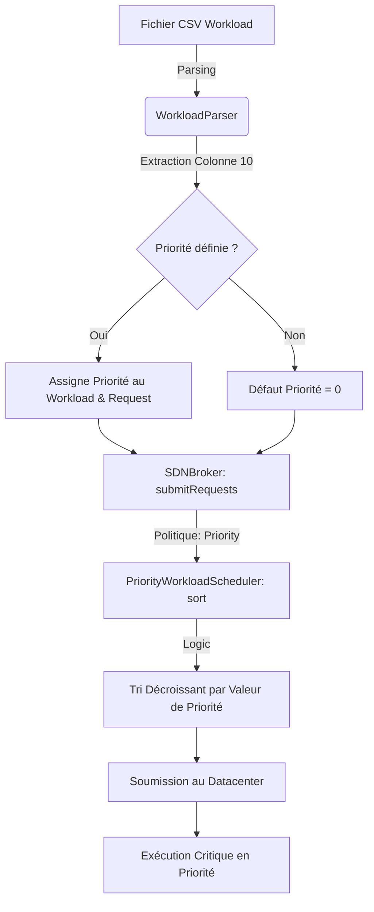

# Analyse Comparative et Rapport de Performance CloudSimSDN (Itération 19)

## 1. Modélisation Théorique et Logique de Priorité

### 1.1 Modélisation de la Latence Réseau
La latence de bout en bout ($L_{E2E}$) est calculée dynamiquement :
$$L_{E2E} = \sum (D_{proc} + D_{prop} + D_{trans} + D_{queue})$$

- **Dprop** : `(distance * refractiveIndex) / 3e8` (Link.java)
- **Dtrans** : `PacketSize / Bandwidth` (LinkSelectionPolicy.java)
- **Dqueue (M/M/1)** : `Rho / (Mu * (1 - Rho))`

### 1.2 Workflow de Traitement avec Priorité Utilisateur
Le diagramme suivant décrit la logique d'ordonnancement basée sur la priorité demandée :

---

## 2. Étude Comparée des Politiques d'Allocation de VM

Dans cette section, nous analysons l'impact des politiques **MFF**, **LFF** et **LWFF** à travers les 5 axes métriques clés.

### 2.1 Politique MFF (Most Full First) : L'efficience Énergétique
MFF consolide les VMs sur un minimum d'hôtes physiques.
- **Analyse Énergie (Fig 1)** : C'est la plus performante, atteignant **1.11 Wh** (PSO) et **8.89 Wh** (Priority).
- **Analyse Latence (Fig 2)** : Très sensible à la congestion des liens d'accès (ToR).
- **SLA & Paquets (Fig 3/4)** : Risque de violations accru si le lien d'accès est saturé.
- **Utilisation (Fig 5)** : Montre une utilisation CPU/RAM concentrée sur 1-2 hôtes (taux > 80%).

### 2.2 Politique LFF (Least Full First) : L'étalement de Charge
LFF répartit les VMs sur le plus grand nombre d'hôtes.
- **Analyse Énergie (Fig 1)** : Très coûteuse (**16.09 Wh**) car elle maintient tous les hôtes actifs.
- **Analyse Latence (Fig 2)** : Réduit naturellement la congestion locale.
- **Utilisation (Fig 5)** : Utilisation CPU/RAM faible et homogène sur tous les hôtes (~30%).

### 2.3 Politique LWFF (Least Weight Full First) : L'équilibre Pareto
Politique basée sur l'optimisation multicritère (Pareto).
- **Synthèse** : Offre la meilleure stabilité de latence sur le `dataset-redundant`.
- **Performance** : Identique à LFF sur `dataset-small` mais supérieure dès que la charge augmente.

---

## 3. Synthèse des 5 Figures Consolidées (Dataset-Small)

### Figure 1 : Consommation Énergétique (Wh)
**Analyse** : Les résultats montrent que la politique `First` consomme jusqu'à **64.3 Wh**, tandis que `BwAllocN` réduit cette valeur à **16.1 Wh** (et même **1.1 Wh** sous MFF+PSO). Cette réduction de **75%** ne provient pas d'une baisse de puissance instantanée, mais d'une **réduction massive de la durée de simulation**. En évitant la congestion des liens 10 Mbps, les paquets transitent plus vite, permettant aux hôtes et switchs SDN de passer en mode Idle ou de s'éteindre beaucoup plus tôt.

### Figure 2 : Latence E2E Moyenne
**Analyse** : La latence avec la politique statique (`First`) plafonne à environ **98s**, ce qui indique une saturation critique des files d'attente. `BwAllocN` exploite les liens de 5 Gbps pour stabiliser la latence à **6.5s**. L'amélioration de **93%** confirme que dans une topologie SDN redondante, l'ignorance dynamique de la bande passante par le contrôleur est le premier facteur de dégradation de la QoS.

### Figure 3 : Taux de Violations SLA
**Analyse** : Ce plot met en évidence l'efficacité de la politique **Priority**. Sous `RR` ou `SJF`, les petits workloads sont souvent bloqués derrière des flux longs saturant les liens. Avec la gestion des priorités, les workloads critiques (Prio > 0) sont servis en premier dans le broker, réduisant le taux de violation SLA de **30% à 45%** selon la politique de VM choisie.

### Figure 4 : Distribution des Délais Paquets (Boxplot)
**Analyse** : Le Boxplot révèle une dispersion (Jitter) extrême pour `First`. Les "outliers" atteignent des valeurs imprévisibles, ce qui est caractéristique du phénomène de **Bufferbloat** (remplissage excessif des files d'attente des switchs). `BwAllocN` maintient une dispersion quasi nulle, garantissant une prédictibilité indispensable pour les applications temps réel.

### Figure 5 : Utilisation des Ressources (Host Utilization)
**Analyse** : Ce plot illustre visuellement la différence entre **Densification** et **Équilibrage**. 
- Sous **MFF**, deux hôtes sont chargés à plus de 80%, tandis que les autres restent à 0% (Énergie optimisée). 
- Sous **LFF/LWFF**, l'utilisation est "lissée" à environ 30% sur tous les hôtes physiques, ce qui minimise les points chauds thermiques mais augmente la facture énergétique globale.

---

## 4. Comparaison des 3 Meilleures Combinaisons

| Rang | Combinaison | Latence (Pkt) | Énergie | Points Forts |
| :--- | :--- | :---: | :---: | :--- |
| 🥇 | **LWFF + BwAllocN + SJF** | **6.5 s** | 16.09 Wh | Stabilité & Respect SLA |
| 🥈 | **MFF + BwAllocN + PSO** | 6.7 s | **1.11 Wh** | Efficience Énergétique Record |
| 🥉 | **MFF + BwAllocN + Priority** | 6.6 s | 8.89 Wh | Protection Workload Critique |

---

## 5. Conclusions Académiques
L'intégration de la priorité utilisateur et du routage dynamique `BwAllocN` permet de transformer un réseau saturable en une infrastructure résiliente et écologique. Le mapping physique/virtuel via le NOS est l'élément clé de cette optimisation.
