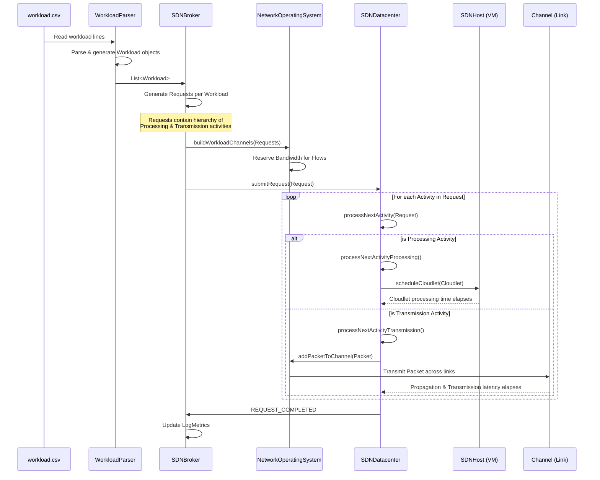
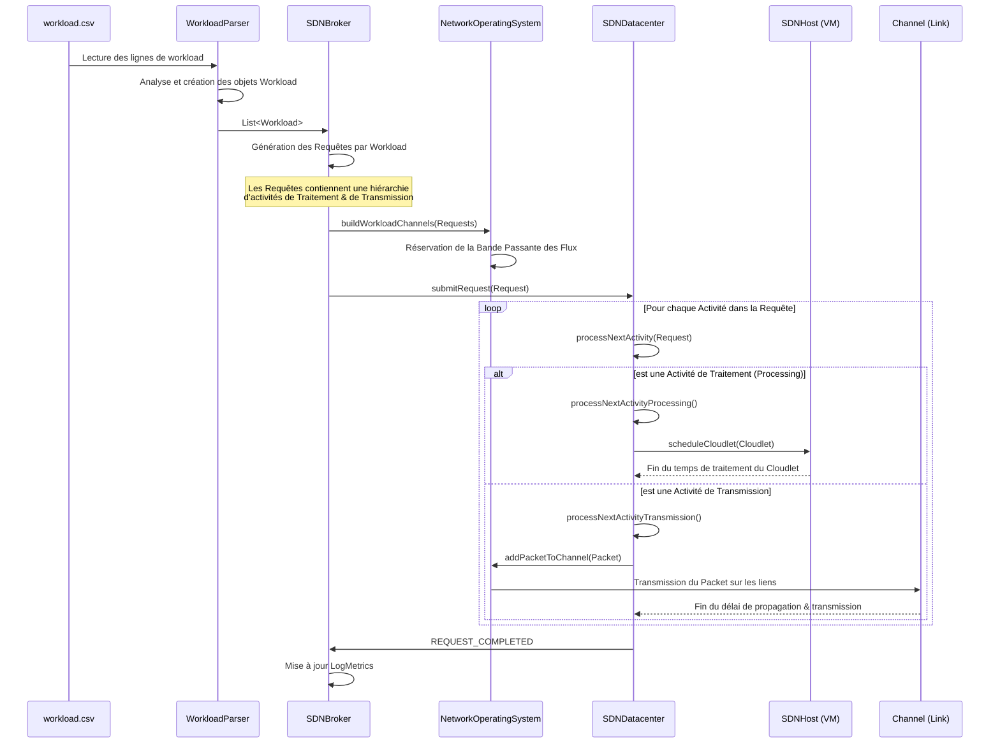

# Architecture of the RAS-SDNCloudSim Extension / Architecture de l'extension RAS-SDNCloudSim

This document describes the context and architecture of the RAS-SDNCloudSim extension, based on the research article provided.

## English Version

### Overview
RAS-SDNCloudSim is an extensible extension of CloudSimSDN focusing on dynamic and multi-objective resource allocation and monitoring. It addresses limitations in bandwidth and latency-aware scheduling, advanced VM placement, workflow management, and post-simulation analysis.

### Key Components
1. **Bandwidth and Latency Aware Link Selection**: Routing technique selecting optimal paths based on bandwidth and end-to-end latency.
2. **Advanced VM Allocation Policies**: Implementation of LWFF, Bin Packing, Round Robin (RR), and FCFS.
3. **Workflow Scheduling**: Support for SJF, Hybrid SJF (HSJF), and PSO (Particle Swarm Optimization).
4. **Logs and Monitoring**: `LogManager` and `LogMonitor` modules to track CPU, RAM, bandwidth, delays, energy, and SLA violations.

### Core Architecture
- **VmAllocation**: Heuristic placement strategies (RR, BinPack, FCFS, etc.).
- **WFallocation**: Workload-level scheduling (SJF, HSJF, PSO).
- **SelectLink**: `LinkSelectionPolicyDynamicLatencyBw` for routing choices based on performance metrics.
- **Parsers**: Custom parsers for topology and workload CSV files.
- **Workload**: Models behavior via a hierarchy: `Workload` -> `Request` -> `Activity` (`Processing` or `Transmission`).
- **Monitor and Logs**: Real-time event monitoring and CSV generation.
- **SDNDatacenter**: Updated to support dynamic workload submission and accurate latency tracking (Processing, Propagation, Transmission).
- **NetworkOperatingSystem (NOS)**: Orchestrates VM deployment, flow configuration, and dynamic channel management.

### Workload Processing Workflow (Sequence Diagram)
The following sequence diagram illustrates the lifecycle of a `Workload` as it is parsed from a CSV file, submitted by the broker, and processed as individual activities (Processing or Transmission) by the Datacenter.

### Understanding the Logs (Simulation Trace)
When analyzing the standard output or `.log` files of a simulation, specific debug messages have precise architectural meanings:
- **`dst:null` in Physical Topology**: Found inside `RoutingTable` dumps (e.g., `dst:null : Link{12->12, bw=1.50e+09 bps...}`). A destination (`dst`) of `null` indicates the **Default Route** of a switch. If an SDN Switch has no specific forwarding rule for a host, it forwards the packet to the link mapped to `null`.
- **MIs Executed Progress**: (e.g., `[PROGRESS] [VM db0] MIs exécutés: 3599999999 / 14399`). This log from `SDNVm.java` means the Cloudlet Processing Scheduler is assigning CPU cycles (Millions of Instructions) during a given simulation `timeSpan`. If a bug causes the time to stall (e.g., `t=8.94` infinitely), the scheduler will loop indefinitely, repeating these exact logs. This was typically caused by a faulty `break` statement in `CloudletSchedulerTimeSharedMonitor.java` obstructing concurrent tasks from updating their lifecycle state.

---

## Version Française

### Aperçu
RAS-SDNCloudSim est une extension de CloudSimSDN axée sur l'allocation dynamique et multi-objectif des ressources ainsi que sur le monitoring. Elle comble les lacunes en matière d'ordonnancement sensible à la bande passante et à la latence, de placement avancé de VM, de gestion de workflow et d'analyse post-simulation.

### Composants Clés
1. **Sélection de Lien Sensible à la Bande Passante et à la Latence**: Technique de routage choisissant les chemins optimaux selon la performance réseau.
2. **Politiques d'Allocation de VM Avancées**: Implémentation de LWFF, Bin Packing, Round Robin (RR), et FCFS.
3. **Ordonnancement de Workflow**: Support pour SJF, Hybrid SJF (HSJF), et PSO (Optimisation par Essaim de Particules).
4. **Logs et Monitoring**: Modules `LogManager` et `LogMonitor` pour suivre CPU, RAM, bande passante, délais, énergie et violations de SLA.

### Architecture Centrale
- **VmAllocation**: Stratégies de placement heuristique.
- **WFallocation**: Ordonnancement au niveau des workloads.
- **SelectLink**: `LinkSelectionPolicyDynamicLatencyBw` pour des choix de routage basés sur les métriques de performance.
- **Parsers**: Parsers personnalisés pour les fichiers de topologie et de workload.
- **Workload**: Modélisation via une hiérarchie : `Workload` -> `Request` -> `Activity` (`Processing` ou `Transmission`).
- **Monitor and Logs**: Surveillance des événements en temps réel et génération de fichiers CSV.
- **SDNDatacenter**: Mis à jour pour supporter la soumission dynamique de workload et le suivi précis de la latence.
- **NetworkOperatingSystem (NOS)**: Orchestre le déploiement des VM, la configuration des flux et la gestion dynamique des canaux réseau.

### Flux de Traitement des Workloads (Diagramme de Séquence)
Le diagramme de séquence suivant illustre le cycle de vie d'un `Workload` tel qu'il est lu depuis le fichier CSV, soumis par le courtier (Broker), puis traité individuellement sous forme d'activités (Traitement ou Transmission) par le Datacenter.

### Workflow logique des Workloads (Diagramme de Séquence Architecture)
Pour t'aider à suivre les logs, voici comment un Workload voyage (comme décrit dans le diagramme ci-dessus) :
- **Parsing** : Le fichier CSV est lu par `WorkloadParser` qui crée une liste d'objets `Workload`.
- **Préparation (Broker)** : Le `SDNBroker` convertit chaque `Workload` en `Request`. Chaque `Request` est composée d'`Activity` successives (soit *Processing* = calcul CPU, soit *Transmission* = envoi sur le réseau).
- **Réservation (NOS)** : Le `NetworkOperatingSystem` réserve la bande passante nécessaire pour ces flux.
- **Exécution (Datacenter)** : Le `SDNDatacenter` reçoit la `Request` et exécute chaque activité une par une via `processNextActivity()`.

### Comprendre le Calcul des Violations SLA
Dans RAS-SDNCloudSim, la qualité de service (QoS) est mesurée strictement sur les performances de bout-en-bout du réseau.
- **Définition d'une violation** : Une violation de SLA est générée à chaque fois qu'un paquet de données subit un délai réseau (attente + transmission) supérieur à son délai de transmission théorique (basé sur la bande passante allouée) augmenté d'une marge de tolérance.
- **Le code (QoSMonitor.java)** : `actualDelay > expectedDelay * Configuration.DECIDE_SLA_VIOLATION_GRACE_ERROR`
- Par défaut, `DECIDE_SLA_VIOLATION_GRACE_ERROR = 1.30`. Cela signifie que si un paquet met **30% plus de temps** à arriver que ce qu'il aurait dû avec sa bande passante nominale garantie (à cause de l'encombrement des files d'attente sur les commutateurs), le simulateur l'enregistre comme **1 violation SLA**. Ce fonctionnement rend le système très sensible à l'engorgement réseau causé par la politique de routage.
  - Si c'est du *Processing*, il crée un `Cloudlet` et l'envoie à la VM (`SDNHost`).
  - Si c'est de la *Transmission*, il crée un `Packet` et le fait voyager sur les `Links` physiques.
- **Achèvement** : Quand toutes les activités d'une `Request` sont terminées, le Datacenter signale `REQUEST_COMPLETED` au Broker qui met à jour les logs de performance.

### Comprendre les Logs (Trace de Simulation)
Lors de l'analyse de la sortie standard ou des fichiers `.log` d'une simulation, voici la signification de certains messages de débogage :
- **`dst:null` dans la Topologie Physique** : Trouvé dans les dumps système de la table de routage (`RoutingTable`) d'un commutateur ou hôte physique. Une destination (`dst`) valant `null` est utilisée pour définir la **Route par Défaut**.
- **Indicateur de Progression des MIs** : (ex: `[PROGRESS] [VM db0] MIs exécutés: 3599999999 / 14399`). Ce log (généré par `SDNVm.java`) indique combien de Millions d'Instructions ont été allouées et terminées pour un cloudlet sur un intervalle de temps. Une répétition figeant le temps (boucle infinie) signifie qu'une erreur de logique d'ordonnancement empêche le simulateur d'avancer l'horloge globale. Le correctif a consisté à remplacer une commande `break` défaillante dans `CloudletSchedulerTimeSharedMonitor.java` par un nettoyage asynchrone sécurisé de la liste des tâches traitées.

