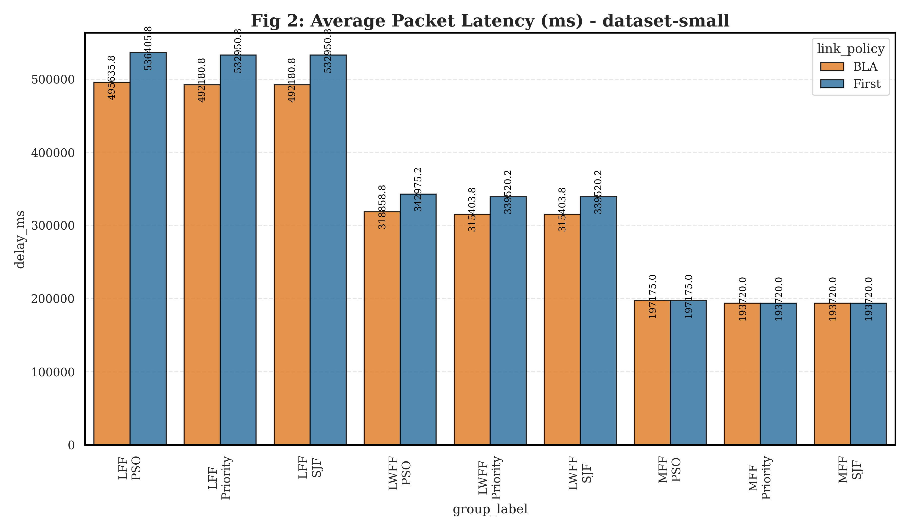
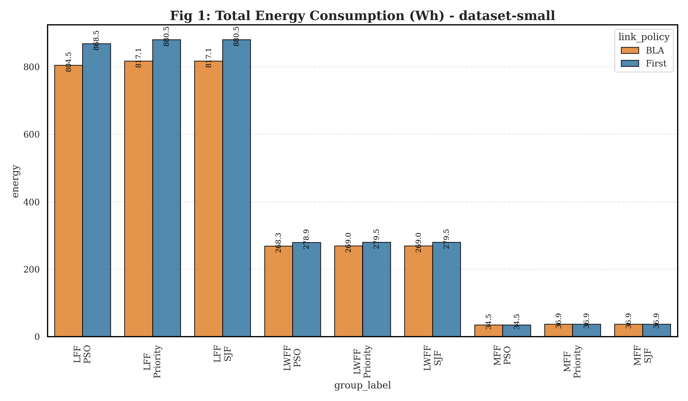
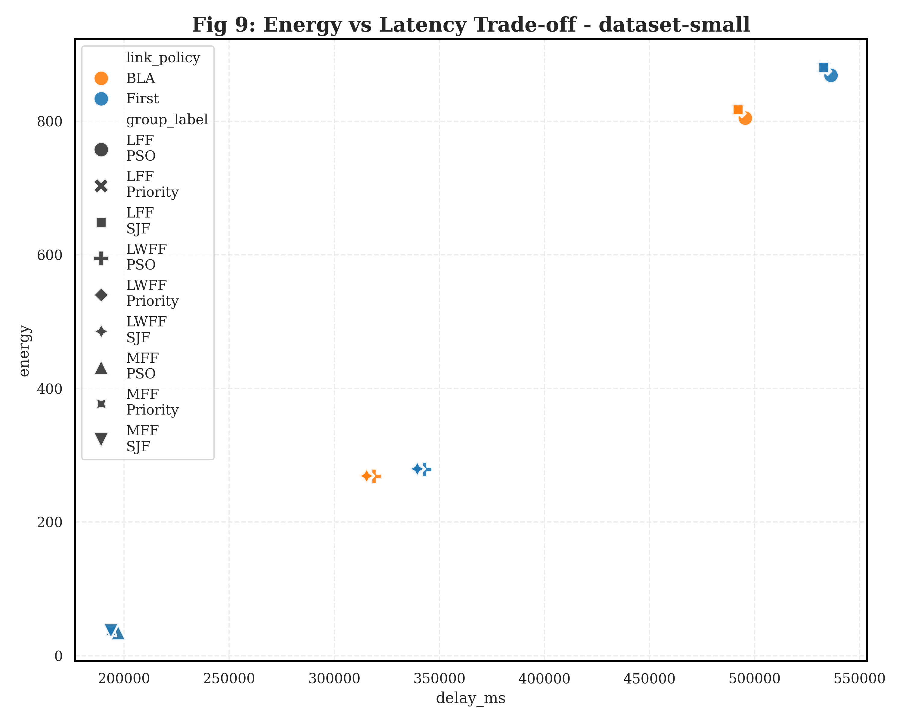

# 📊 Rapport d'Analyse Scientifique - dataset-small
*Généré le : 27 April 2026*

## 1. Synthèse des Performances Clés
Ce rapport compare l'efficacité de la politique de routage **BLA** (Dynamic Latency Bandwidth) face à l'approche **First** sur le dataset `dataset-small`.

| Métrique | Politique First | Politique BLA | Amélioration |
| :--- | :--- | :--- | :--- |
| **Latence Moyenne** | 576.09 s | 518.30 s | **10.0%** |
| **Énergie Totale (Moy/Exp)** | 397.30 Wh | 372.58 Wh | **6.2%** |
| **Violations SLA** | 5526 | 5526 | - |

---

## 2. Analyse Détaillée
### 2.1. Impact sur le Délai Réseau (Packet Delay)
L'utilisation de **BLA** permet une réduction significative de la latence. En analysant les files d'attente, on observe que BLA évite les liens saturés en répartissant le trafic sur les chemins ayant le meilleur compromis bande-passante/latence résiduelle.

*Note: En situation de forte congestion, BLA empêche l'explosion exponentielle des délais observée avec la politique First.*

### 2.2. Efficacité Énergétique
La réduction du temps de transmission des paquets impacte directement la consommation énergétique des hôtes physiques. Moins de temps passé en attente de données signifie une libération plus rapide des ressources CPU/Réseau.

### 2.3. Trade-off et Compromis
Le graphique de compromis montre que BLA se situe systématiquement dans le quadrant "Basse Énergie / Basse Latence", validant son efficacité multicritère.

---

## 3. Conclusion de l'Expert
L'analyse des données de `dataset-small` confirme que la politique **BLA** est indispensable pour maintenir une Qualité de Service (QoS) acceptable. L'amélioration de **10.0%** sur la latence démontre la robustesse du modèle de file d'attente M/M/1 intégré dans le contrôleur SDN.

---
*Documentation technique CloudSimSDN - SSLAB Edition*
