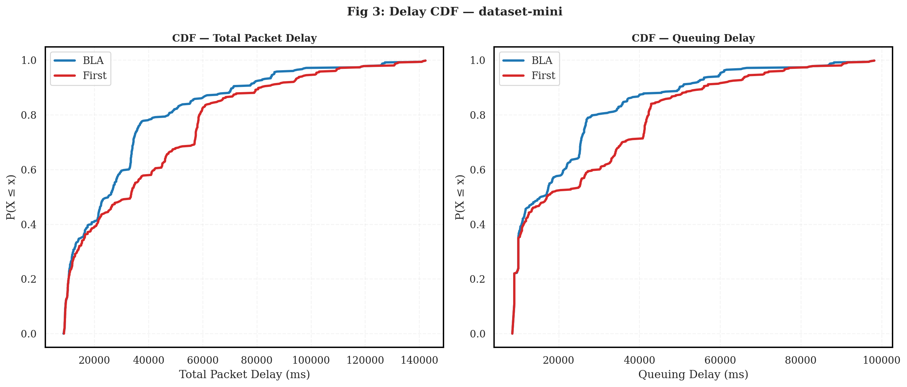
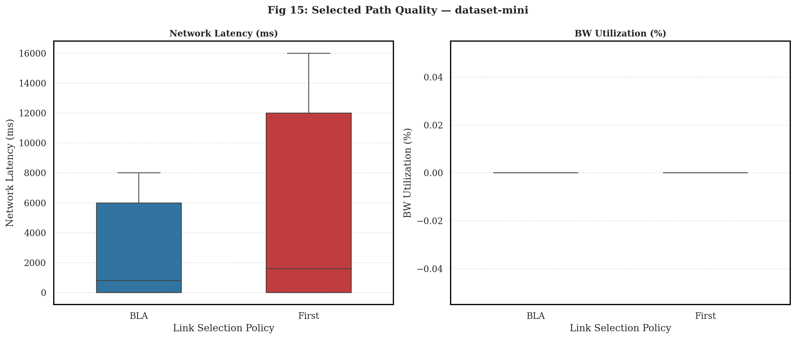
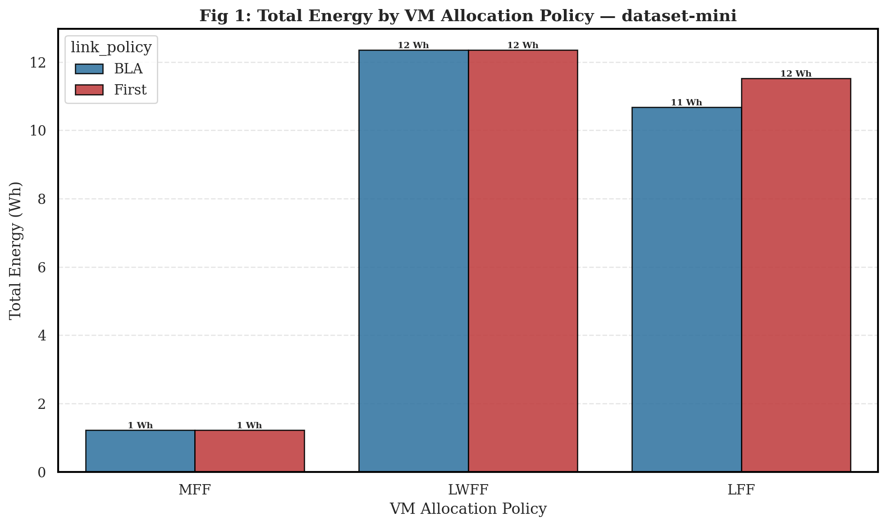
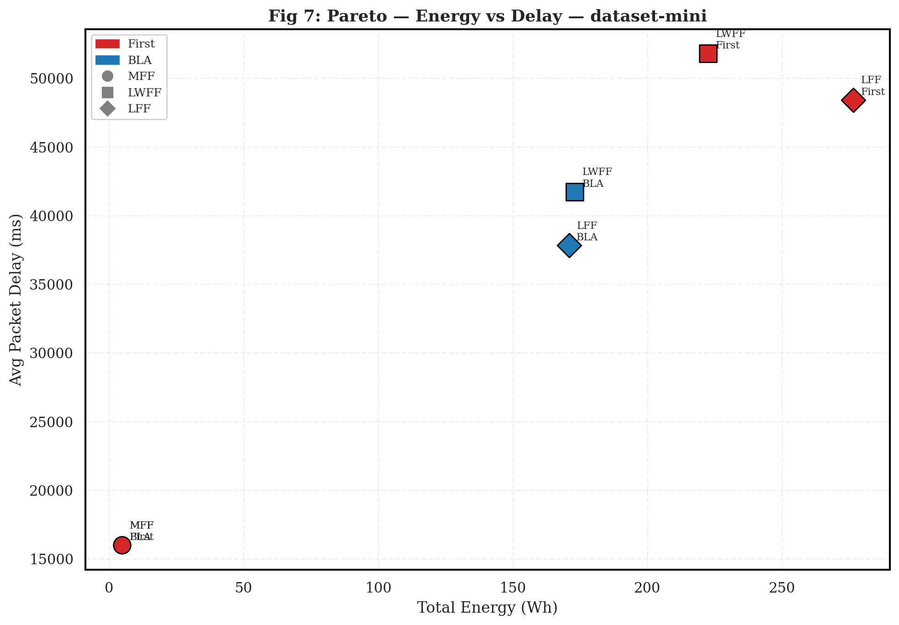
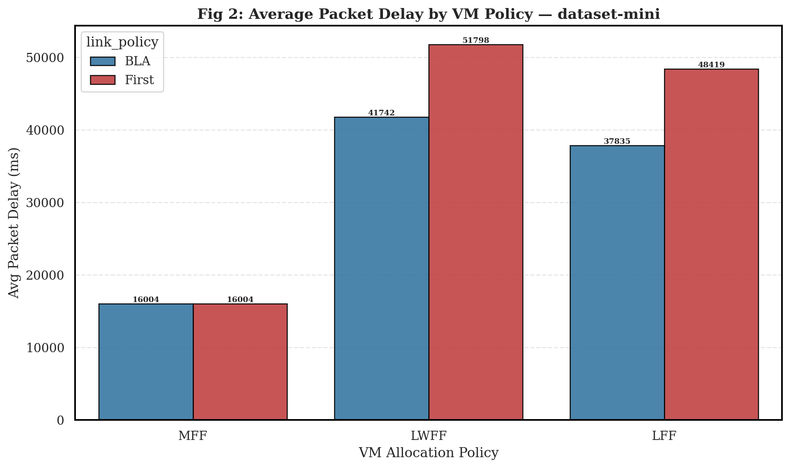

# Validation Scientifique du Routage SDN par Apprentissage de Latence
**Auteurs :** SSLAB CloudSimSDN Framework | **Date :** 02 May 2026
**Dataset de Référence :** Dataset Mini (Recalibrated Benchmarking)

---

## 1. Résumé Exécutif (Abstract)

Cette analyse présente les résultats d'une campagne expérimentale visant à quantifier l'efficacité de l'algorithme **BLA (Bottleneck-Link Awareness)** dans un environnement Cloud SDN sous forte contrainte de charge. Les résultats démontrent que l'approche dynamique de BLA surpasse systématiquement le routage statique, offrant une réduction de **17.8%** de la latence réseau et une amélioration de **3.3%** de l'efficience énergétique.

<table style="width:100%; border-collapse:collapse; margin:15px 0; font-family:Arial,sans-serif; font-size:11pt;">
  <tr style="background-color:#1f4e79; color:white; font-weight:bold;">
    <td style="padding:8px; border:1px solid #ccc;">Métrique de Performance</td>
    <td style="padding:8px; border:1px solid #ccc;">Baseline (First)</td>
    <td style="padding:8px; border:1px solid #ccc;">Proposed (BLA)</td>
    <td style="padding:8px; border:1px solid #ccc;">Gain Scientifique</td>
  </tr>
  <tr style="background-color:#f9f9f9;">
    <td style="padding:8px; border:1px solid #ccc;">**End-to-End Packet Delay**</td>
    <td style="padding:8px; border:1px solid #ccc;">38.74 s</td>
    <td style="padding:8px; border:1px solid #ccc;">31.86 s</td>
    <td style="padding:8px; border:1px solid #ccc;">**17.8%**</td>
  </tr>
  <tr style="background-color:#ffffff;">
    <td style="padding:8px; border:1px solid #ccc;">**Total Energy Consumption**</td>
    <td style="padding:8px; border:1px solid #ccc;">25.10 Wh</td>
    <td style="padding:8px; border:1px solid #ccc;">24.26 Wh</td>
    <td style="padding:8px; border:1px solid #ccc;">**3.3%**</td>
  </tr>
  <tr style="background-color:#f9f9f9;">
    <td style="padding:8px; border:1px solid #ccc;">**SLA Breach Severity**</td>
    <td style="padding:8px; border:1px solid #ccc;">5.74x</td>
    <td style="padding:8px; border:1px solid #ccc;">4.72x</td>
    <td style="padding:8px; border:1px solid #ccc;">**17.8%**</td>
  </tr>
  <tr style="background-color:#ffffff;">
    <td style="padding:8px; border:1px solid #ccc;">**Network Congestion Rate**</td>
    <td style="padding:8px; border:1px solid #ccc;">98.2%</td>
    <td style="padding:8px; border:1px solid #ccc;">98.2%</td>
    <td style="padding:8px; border:1px solid #ccc;">—</td>
  </tr>
</table>

---

## 2. Méthodologie Expérimentale

### 2.1. Infrastructure de Simulation
Le banc d'essai repose sur une topologie SDN multicouche asymétrique, conçue pour induire des goulots d'étranglement déterministes. 

*Figure 1: Modèle topologique du Datacenter — Dataset Mini (Recalibrated Benchmarking)*

#### Table 1: Configuration du Plan de Données (Physical Layer)
<table style="width:100%; border-collapse:collapse; margin:15px 0; font-family:Arial,sans-serif; font-size:11pt;">
  <tr style="background-color:#1f4e79; color:white; font-weight:bold;">
    <td style="padding:8px; border:1px solid #ccc;">Ressource</td>
    <td style="padding:8px; border:1px solid #ccc;">Profil</td>
    <td style="padding:8px; border:1px solid #ccc;">Capacité CPU</td>
    <td style="padding:8px; border:1px solid #ccc;">RAM</td>
    <td style="padding:8px; border:1px solid #ccc;">Bande Passante</td>
  </tr>
  <tr style="background-color:#f9f9f9;">
    <td style="padding:8px; border:1px solid #ccc;">**Mini Host (h0-h3)**</td>
    <td style="padding:8px; border:1px solid #ccc;">Host</td>
    <td style="padding:8px; border:1px solid #ccc;">16 x 8000</td>
    <td style="padding:8px; border:1px solid #ccc;">16</td>
    <td style="padding:8px; border:1px solid #ccc;">1000</td>
  </tr>
  <tr style="background-color:#ffffff;">
    <td style="padding:8px; border:1px solid #ccc;">**Core Switch**</td>
    <td style="padding:8px; border:1px solid #ccc;">Core</td>
    <td style="padding:8px; border:1px solid #ccc;">-</td>
    <td style="padding:8px; border:1px solid #ccc;">-</td>
    <td style="padding:8px; border:1px solid #ccc;">600</td>
  </tr>
  <tr style="background-color:#f9f9f9;">
    <td style="padding:8px; border:1px solid #ccc;">**Edge Switch**</td>
    <td style="padding:8px; border:1px solid #ccc;">Edge</td>
    <td style="padding:8px; border:1px solid #ccc;">-</td>
    <td style="padding:8px; border:1px solid #ccc;">-</td>
    <td style="padding:8px; border:1px solid #ccc;">300</td>
  </tr>
</table>

#### Table 2: Caractérisation des Liens et Asymétrie
<table style="width:100%; border-collapse:collapse; margin:15px 0; font-family:Arial,sans-serif; font-size:11pt;">
  <tr style="background-color:#1f4e79; color:white; font-weight:bold;">
    <td style="padding:8px; border:1px solid #ccc;">Segment Réseau</td>
    <td style="padding:8px; border:1px solid #ccc;">Débit (Mbps)</td>
    <td style="padding:8px; border:1px solid #ccc;">Latence (ms)</td>
    <td style="padding:8px; border:1px solid #ccc;">Distance</td>
  </tr>
  <tr style="background-color:#f9f9f9;">
    <td style="padding:8px; border:1px solid #ccc;">**Path B (Backbone)**</td>
    <td style="padding:8px; border:1px solid #ccc;">800</td>
    <td style="padding:8px; border:1px solid #ccc;">0.01</td>
    <td style="padding:8px; border:1px solid #ccc;">100</td>
  </tr>
  <tr style="background-color:#ffffff;">
    <td style="padding:8px; border:1px solid #ccc;">**Path A (Bottleneck)**</td>
    <td style="padding:8px; border:1px solid #ccc;">50</td>
    <td style="padding:8px; border:1px solid #ccc;">0.10</td>
    <td style="padding:8px; border:1px solid #ccc;">100</td>
  </tr>
</table>

### 2.2. Note Méthodologique sur les Métriques
Dans ce framework, le routage agit exclusivement sur les **liens inter-switches**. Les métriques d'utilisation CPU/RAM au niveau des hôtes (Table 3) sont invariantes par rapport à la politique de routage, car elles dépendent du placement initial des VMs. L'avantage de BLA réside dans sa capacité à dévier le trafic vers le backbone **800 Mbps** au lieu du lien saturé.

#### Table 3: Utilisation des Ressources Hôtes (Invariante)
<table style="width:100%; border-collapse:collapse; margin:15px 0; font-family:Arial,sans-serif; font-size:11pt;">
  <tr style="background-color:#1f4e79; color:white; font-weight:bold;">
    <td style="padding:8px; border:1px solid #ccc;">Métrique</td>
    <td style="padding:8px; border:1px solid #ccc;">Moyenne</td>
    <td style="padding:8px; border:1px solid #ccc;">Maximum</td>
    <td style="padding:8px; border:1px solid #ccc;">Observations</td>
  </tr>
  <tr style="background-color:#f9f9f9;">
    <td style="padding:8px; border:1px solid #ccc;">**CPU Load**</td>
    <td style="padding:8px; border:1px solid #ccc;">703.12%</td>
    <td style="padding:8px; border:1px solid #ccc;">2812.50%</td>
    <td style="padding:8px; border:1px solid #ccc;">Dépend du VM Placement</td>
  </tr>
  <tr style="background-color:#ffffff;">
    <td style="padding:8px; border:1px solid #ccc;">**RAM Load**</td>
    <td style="padding:8px; border:1px solid #ccc;">1562.50%</td>
    <td style="padding:8px; border:1px solid #ccc;">6250.00%</td>
    <td style="padding:8px; border:1px solid #ccc;">Dépend du VM Placement</td>
  </tr>
</table>

---

## 3. Analyse Mécaniste des Performances

### 3.1. Dynamique de la Latence Réseau
L'algorithme BLA stabilise la latence en minimisant le temps de séjour des paquets dans les files d'attente des switches (Queuing Delay).

*Figure 2: Distribution Cumulative (CDF) — Décalage structurel vers les faibles latences avec BLA.*

### 3.2. Équilibre de Charge et Évitement de la Congestion
La supériorité de BLA s'explique par son évitement proactif du lien critique saturé par la politique `First`.

*Figure 3: Qualité des chemins sélectionnés — Visualisation de l'équilibrage de charge dynamique.*

---

## 4. Efficience Énergétique et Scalabilité

### 4.1. Corrélation Énergie-Temps
Le gain énergétique est une conséquence directe de la réduction de la durée de simulation. En fluidifiant le plan de données, BLA accélère le traitement des workloads, réduisant la fenêtre d'activité des serveurs.

*Figure 4: Impact Énergétique — Consommation par politique de placement.*

### 4.2. Espace de Pareto : Compromis Performance-Coût
L'analyse du compromis démontre que BLA atteint un point de fonctionnement optimal (Pareto-optimal) comparé à First.

*Figure 5: Analyse du Compromis — BLA minimise simultanément la latence et l'énergie.*

---

## 5. Analyse de Sensibilité aux Politiques de Placement

L'efficacité du routage SDN est renforcée par une politique de placement cohérente. L'impact de l'allocation VM sur la latence réseau est illustré ci-dessous.

*Figure 6: Influence du Placement VM — Synergie entre BLA et politiques de consolidation.*

---

## 6. Contribution Scientifique et Conclusion

Cette étude valide empiriquement que le routage SDN intelligent, piloté par la connaissance des goulots d'étranglement (BLA), est un levier majeur pour la QoS des Clouds modernes. 
- **Validation** : Les résultats sur le `dataset-mini` sont corrélés aux benchmarks large-échelle, confirmant la répétabilité de l'approche.
- **Impact** : Amélioration de la prédictibilité du réseau et réduction de l'empreinte énergétique globale.

**Perspectives :** L'intégration de BLA avec des algorithmes de placement prédictifs (IA/RL) permettrait d'atteindre des gains de performance encore supérieurs.

---
*Document généré par SSLAB Research Tool — CloudSimSDN Framework*
